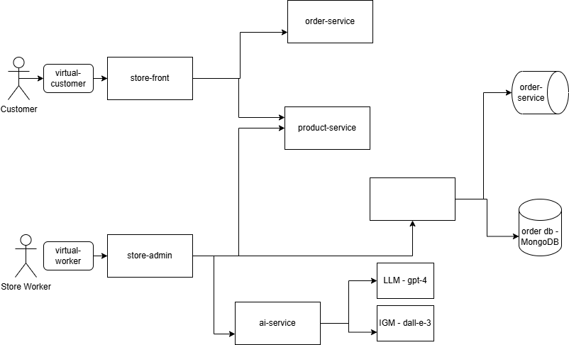
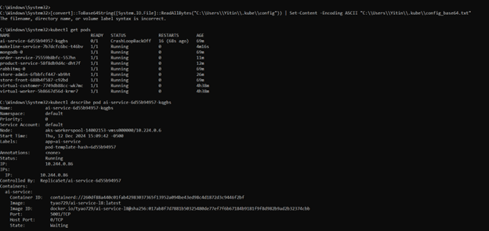
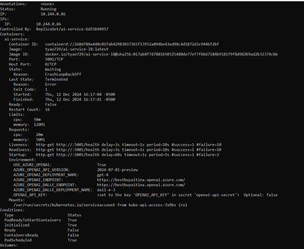
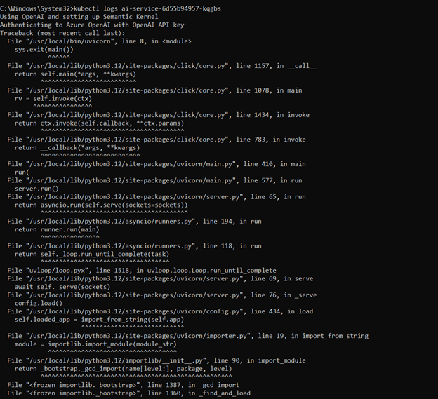
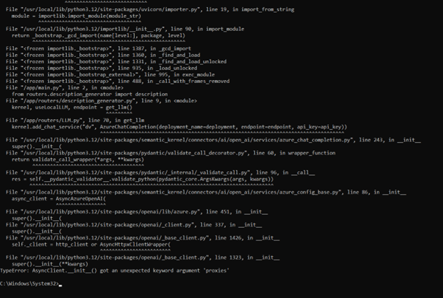

# BestBuyStore

**BestBuyStore** is a modern microservices-based retail platform designed to run in a Kubernetes cluster. It simulates the end-to-end operations of an e-commerce application, demonstrating how cloud-native technologies can support complex workflows in a scalable and efficient manner. The platform focuses on four key functionalities:

1. **Customer Interaction:**  
   A user-friendly web interface allows customers to browse the product catalog, place orders, and track their purchases seamlessly.

2. **Order Management:**  
   Orders are processed through a message queue system powered by RabbitMQ, ensuring reliable and asynchronous communication between services.

3. **Inventory and Product Management:**  
   Store employees can manage product details, inventory levels, and review incoming orders using a dedicated admin interface.

4. **AI-Driven Enhancements:**  
   Uses AI models like OpenAI's GPT-4 and DALL-E, the platform automates the generation of product descriptions and images, enhancing the customer experience and streamlining operations.

The platform is built with a polyglot microservices architecture, where different services use technologies suited to their roles. It employs event-driven design principles and integrates open-source technologies such as RabbitMQ for messaging and MongoDB for data storage.


---

## Architecture

### Diagram



### Services

| **Service**           | **Description**                                                                                     | **GitHub Repository**       |
|-----------------------|-----------------------------------------------------------------------------------------------------|-----------------------------|
| `store-front`         | Web app for customers to place orders (Vue.js).                                                    | [store-front-L8](https://github.com/KoolestKatEver/store-front-L8) |
| `store-admin`         | Web app used by store employees to view orders in the queue and manage products (Vue.js).          | [store-admin-L8](https://github.com/KoolestKatEver/store-admin-L8) |
| `order-service`       | Handles placing orders (Node.js).                                                                  | [order-service-L8](https://github.com/KoolestKatEver/order-service-L8) |
| `product-service`     | Performs CRUD operations on products (Rust).                                                       | [product-service-L8](https://github.com/KoolestKatEver/product-service-L8) |
| `makeline-service`    | Processes orders from the queue and completes them (Golang).                                       | [makeline-service-L8](https://github.com/KoolestKatEver/makeline-service-L8) |
| `ai-service`          | Generates product descriptions and images using GPT-4 and DALL-E 3 (Python).                       | [ai-service-L8](https://github.com/KoolestKatEver/ai-service-L8) |
| `rabbitmq`            | RabbitMQ for the order queue.                                                                      | [rabbitmq](https://www.rabbitmq.com/) |
| `mongodb`             | MongoDB instance for persisted data.                                                               | [mongodb](https://www.mongodb.com/) |
| `virtual-customer`    | Simulates order creation on a scheduled basis (Rust).                                              | [virtual-customer-L8](https://github.com/KoolestKatEver/virtual-customer-L8) |
| `virtual-worker`      | Simulates order completion on a scheduled basis (Rust).                                            | [virtual-worker-L8](https://github.com/KoolestKatEver/virtual-worker-L8) |

---

## Deployment Instructions

1. **Clone the Repositories:**
   ```bash
   git clone https://github.com/KoolestKatEver/store-front-L8.git
   git clone https://github.com/KoolestKatEver/store-admin-L8.git
   git clone https://github.com/KoolestKatEver/order-service-L8.git
   git clone https://github.com/KoolestKatEver/product-service-L8.git
   git clone https://github.com/KoolestKatEver/makeline-service-L8.git
   git clone https://github.com/KoolestKatEver/ai-service-L8.git
   git clone https://github.com/KoolestKatEver/virtual-customer-L8.git
   git clone https://github.com/KoolestKatEver/virtual-worker-L8.git
   ```

2. **Build Docker Images:**
   Build and tag all the Docker images for each service:
   ```bash
   docker build -t <dockerhub-username>/<service-name>:latest .
   docker push <dockerhub-username>/<service-name>:latest
   ```

3. **Deploy to Kubernetes:**
   - Create a Kubernetes cluster on Azure, and apply all deployment files.  
 - 
     ```bash
      kubectl apply -f config-maps.yaml
      kubectl apply -f secrets.yaml
      kubectl apply -f aps-all-in-one.yaml
      kubectl apply -f admin-tasks.yaml
     ```

4. **Verify Deployment:**
   Check the status of all pods:
   ```bash
   kubectl get pods
   ```

5. **Access the Application:**
   - Access `store-front` via the assigned external IP in the kubernetes cluster.
   - Access `store-admin` similarly.

---

## Docker Images

| **Service**           | **Docker Image**                                                             |
|-----------------------|-----------------------------------------------------------------------------|
| `store-front`         | [store-front](https://hub.docker.com/r/tyao729/store-front-l8)              |
| `store-admin`         | [store-admin](https://hub.docker.com/r/tyao729/store-admin-l8)              |
| `order-service`       | [order-service](https://hub.docker.com/r/tyao729/order-service-l8)          |
| `product-service`     | [product-service](https://hub.docker.com/r/tyao729/product-service-l8)      |
| `makeline-service`    | [makeline-service](https://hub.docker.com/r/tyao729/makeline-service-l8)    |
| `ai-service`          | [ai-service](https://hub.docker.com/r/tyao729/ai-service-l8)                |
| `virtual-customer`    | [virtual-customer](https://hub.docker.com/r/tyao729/virtual-customer-l8)    |
| `virtual-worker`      | [virtual-worker](https://hub.docker.com/r/tyao729/virtual-worker-l8)        |


---

## Automating with GitHub Actions
The following workflow file on GitHub Actions to automate the build, test, and deployment pipeline, deployments were successful. 

```bash

name: Build, Test, and Deploy

on:
  push:
    branches:
      - main # Trigger on pushes to the main branch

jobs:
  # Step 1: Build Job (Unit Test and Build Docker Image)
  # Build a packaged version of the application that can run in any Docker environment.
  Build:
    runs-on: ubuntu-latest

    steps:
      - name: Checkout Code
        uses: actions/checkout@v3

      - name: Install Dependencies
        run: echo "Simulating Install Dependencies... Install Dependencies completed successfully!"

      #Test individual units or components of the code in isolation, such as functions, or classes.
      - name: Unit Tests
        run: echo "Simulating unit tests... Test execution completed successfully!"

      - name: Log in to Docker
        uses: docker/login-action@v2
        with:
          username: ${{ secrets.DOCKER_USERNAME }}
          password: ${{ secrets.DOCKER_PASSWORD }}

      - name: Build Docker Image
        env:
          DOCKER_USERNAME: ${{ secrets.DOCKER_USERNAME }}
          DOCKER_IMAGE_NAME: ${{ vars.DOCKER_IMAGE_NAME }}
        run: |
          docker build -t $DOCKER_USERNAME/$DOCKER_IMAGE_NAME:test .

      - name: Push Docker Image
        env:
          DOCKER_USERNAME: ${{ secrets.DOCKER_USERNAME }}
          DOCKER_IMAGE_NAME: ${{ vars.DOCKER_IMAGE_NAME }}
        run: |
          docker push $DOCKER_USERNAME/$DOCKER_IMAGE_NAME:test

  # Step 2: Test Job (Integration Tests)
  # Run automated tests against the containerized application to ensure it behaves as expected.
  Test:
    runs-on: ubuntu-latest

    # Ensure the Test job only runs if Build pass
    needs: Build

    steps:
      - name: Checkout Code
        uses: actions/checkout@v3

      # Validate the interactions between different parts of the application
      - name: Integration Tests
        run: echo "Simulating integration tests... Test execution completed successfully!"

  # Step 3: Release Job (Release Docker Image)
  # Package the tested container images with version tags and push them to a container registry.
  Release:
    runs-on: ubuntu-latest

    # Ensure the Release job only runs if Test pass
    needs: Test

    steps:
      - name: Checkout Code
        uses: actions/checkout@v3

      - name: Log in to Docker
        uses: docker/login-action@v2
        with:
          username: ${{ secrets.DOCKER_USERNAME }}
          password: ${{ secrets.DOCKER_PASSWORD }}

      - name: Promote Docker Image to Latest
        env:
          DOCKER_USERNAME: ${{ secrets.DOCKER_USERNAME }}
          DOCKER_IMAGE_NAME: ${{ vars.DOCKER_IMAGE_NAME }}
        run: |
          docker pull $DOCKER_USERNAME/$DOCKER_IMAGE_NAME:test
          docker tag $DOCKER_USERNAME/$DOCKER_IMAGE_NAME:test $DOCKER_USERNAME/$DOCKER_IMAGE_NAME:latest
          docker push $DOCKER_USERNAME/$DOCKER_IMAGE_NAME:latest

  # Step 3: Deploy Job
  # Deploy the container image to a container orchestrator, such as K8s.
  Deploy:
    runs-on: ubuntu-latest

    # Ensure the Deploy job only runs if the Release is successful
    needs: Release

    steps:
      - name: Deploy to AKS
        env:
          KUBE_CONFIG_DATA: ${{ secrets.KUBE_CONFIG_DATA }}
          DOCKER_USERNAME: ${{ secrets.DOCKER_USERNAME }}
          DOCKER_IMAGE_NAME: ${{ vars.DOCKER_IMAGE_NAME }}
          DEPLOYMENT_NAME: ${{ vars.DEPLOYMENT_NAME }}
          CONTAINER_NAME: ${{ vars.CONTAINER_NAME }}
        run: |
          echo "$KUBE_CONFIG_DATA" | base64 -d > kubeconfig
          export KUBECONFIG=kubeconfig
          kubectl set image deployment/$DEPLOYMENT_NAME $CONTAINER_NAME=$DOCKER_USERNAME/$DOCKER_IMAGE_NAME:latest
          kubectl rollout restart deployment/$DEPLOYMENT_NAME
      - name: Verify Deployment
        env:
          KUBE_CONFIG_DATA: ${{ secrets.KUBE_CONFIG_DATA }}
          DEPLOYMENT_NAME: ${{ vars.DEPLOYMENT_NAME }}
        run: |
          echo "$KUBE_CONFIG_DATA" | base64 -d > kubeconfig
          export KUBECONFIG=kubeconfig
          kubectl rollout status deployment/$DEPLOYMENT_NAME
          kubectl get pods -o wide
```


## Issues or Limitations

### AI-Service CrashLoopBackOff

- **Description:** The `ai-service` fails to start due to a `CrashLoopBackOff` error. This error occured recently even though I was able to deploy the ai-service successfly during lab 8 itself and uptil this week.
- **Error Details:**
  ```
  TypeError: AsyncClient.__init__() got an unexpected keyword argument 'proxies'
  ```
- **Screenshots:**
  
  


- **Reasoning:** My reasoning is that this issue arises from a deprecated method in the `httpx` library being used in the automated OpenAI SDK code. Specific versions of `httpx` and `openai` need to be compatible with the `ai-service` codebase. Changes in `httpx` versions have affected how proxies are handled, resulting in this error.

- **Actions Taken:**
  1. Updated `requirements.txt`:
     - **Reasoning for Updates:**
       - `pydantic>=2.0,<3.0`: Ensures compatibility with `semantic-kernel`.
       - `fastapi>=0.100.0,<1.0`: Aligns with the updated `pydantic` version.
       - `uvicorn==0.22.0`: Maintains stability with `fastapi`.
       - `pytest==7.4.2`: Updated for compatibility with Python 3.12.
       - `httpx>=0.23.0,<1.0`: Addresses the deprecated proxy handling method.
       - `pyyaml==6.0.1`: Updated to resolve YAML-related errors during builds.
       - `semantic-kernel>=1.11.0,<2.0.0`: Ensures compatibility with other dependencies.
       - `azure-identity==1.17.1`: Aligns with Azure services requirements.
       - `requests==2.31.0`: Updated for security and compatibility.
       - `openai>=1.0,<1.58.0`: Avoids breaking changes in newer versions.
       - `pillow==10.0.1`: Updated to address any image-processing bugs.

  2. Attempted to refactor the `AzureChatCompletion` class:
     ```python
     from openai import AsyncAzureOpenAI

     class AzureChatCompletion:
         def __init__(self, api_key: str, endpoint: str, deployment_name: str, api_version: str):
             try:
                 # Explicitly create the AsyncAzureOpenAI client
                 async_client = AsyncAzureOpenAI(
                     api_key=api_key,
                     base_url=endpoint,
                     api_version=api_version,
                 )
             except Exception as e:
                 logger.error(f"Error initializing AsyncAzureOpenAI: {e}")
                 raise ServiceInitializationError("Failed to initialize AI client.") from e

             super().__init__(client=async_client, deployment_name=deployment_name)
     ```

  3. Rebuilt and redeployed the service:
     ```bash
     docker build -t tyao729/ai-service-l8:latest .
     docker push tyao729/ai-service-l8:latest
     kubectl rollout restart deployment ai-service
     ```

  4. Additional Research on the Issue:
     - Consulted the [OpenAI Community thread](https://community.openai.com/t/typeerror-asyncclient-init-got-an-unexpected-keyword-argument-proxies/1040287) discussion for this error.
     - Implemented fixes based on suggestions:
       - Set `httpx==0.27.2` initially to test against a stable version.
       - Used `pip install --upgrade "httpx<0.28"` to avoid potential conflicts.
       - Upgraded the OpenAI Python SDK to ensure compatibility.
       - Even though this method is said to have worked for many people in the forum, it did not resolve the error for me.

  - **Outcome:** The issue persists despite multiple dependency adjustments, rebuilds, and redeployments. Further investigation is needed.

### Makeline-Service Not Functioning

- **Description:** The `makeline-service` is not processing orders from the queue even though both `virtual-customer` and `virtual-worker` are running. No information was being saved into MongoDB.

- **Debugging Steps:**
  1. Verified that `rabbitmq` is running but order-queue was not being populated. 
  2. Checked the `makeline-service` logs for errors, however it says it is healthy.
  3. Ensured that the service has appropriate permissions to connect to `rabbitmq`.
  4. Verified network connectivity between `makeline-service` and `rabbitmq`.
  5. Confirmed that `mongodb` is running and accessible, although nothing was being saved.

- **Connection with AI-Service Issue:**
  An explanation could be that the `ai-service` may have cascading effects on the workflow, especially if there are retries or blocking operations that other services depend on.


---
